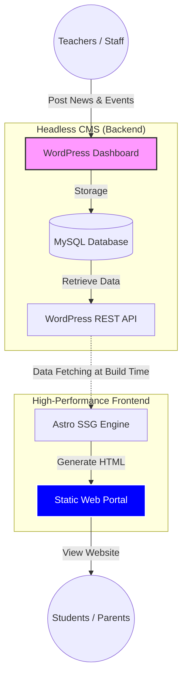

# 🏫 เว็บไซต์พอร์ทัลโรงเรียน (School Smart Portal)
### **สถาปัตยกรรม Headless CMS: Astro + WordPress**

---

## 📋 ภาพรวมของโครงการ (Executive Summary)
โครงการนี้เป็นการพัฒนาระบบบริหารจัดการเนื้อหาเว็บไซต์สถานศึกษารูปแบบใหม่ โดยใช้แนวคิด **Decoupled Architecture** หรือการแยกส่วนการแสดงผล (Frontend) ออกจากระบบจัดการเนื้อหา (Backend) เพื่อแก้ไขปัญหาความล่าช้าในการโหลดข้อมูล (Loading Speed) และเพิ่มความปลอดภัยให้กับระบบ โดยยังคงรักษาความง่ายในการบริหารจัดการเนื้อหาสำหรับบุคลากรทางการศึกษา

---

## 🎯 วัตถุประสงค์ของระบบ (System Objectives)
1.  **High Performance:** เพื่อเพิ่มประสิทธิภาพการเข้าถึงข้อมูลให้รวดเร็วที่สุดผ่านการทำ Static Site Generation (SSG) ซึ่งส่งผลดีต่อประสบการณ์ผู้ใช้งาน (UX) และการจัดอันดับบน Google (SEO)
2.  **User-Friendly Content Management:** เพื่อให้บุคลากรในโรงเรียนสามารถอัปเดตข่าวสารและกิจกรรมได้ด้วยตนเองผ่านระบบ WordPress ที่คุ้นเคย โดยไม่จำเป็นต้องมีความรู้ด้านการเขียนโปรแกรม
3.  **System Security:** เพื่อลดความเสี่ยงจากการโจมตีทางไซเบอร์โดยการซ่อนระบบหลังบ้าน (Headless WordPress) ไว้เบื้องหลัง และแสดงผลเฉพาะไฟล์ Static ผ่าน Astro
4.  **Operational Efficiency:** ลดภาระการทำงานของเซิร์ฟเวอร์และค่าใช้จ่ายในการดูแลรักษาในระยะยาว

---

## 🛠️ รายละเอียดทางเทคนิค (Technical Stack)

| ส่วนประกอบ (Component) | เทคโนโลยีที่เลือกใช้ (Technology) | เหตุผลและความสำคัญเชิงระบบ (Reasoning) |
| :--- | :--- | :--- |
| **Frontend Framework** | **Astro (SSG)** | มุ่งเน้นความเร็วสูงสุดโดยการส่งมอบ HTML ที่มี JavaScript น้อยที่สุดไปยังผู้ใช้งาน |
| **Headless CMS** | **WordPress** | ใช้เป็นฐานข้อมูลและส่วนติดต่อผู้ใช้งานสำหรับคุณครู เพื่อความง่ายและรวดเร็วในการจัดการเนื้อหา |
| **Data Communication** | **REST API** | มาตรฐานการรับส่งข้อมูลที่มีความเสถียรและยืดหยุ่นสูงในการเชื่อมต่อระหว่างระบบ |
| **User Interface** | **Tailwind CSS** | การออกแบบที่เน้นความทันสมัย รองรับการแสดงผลทุกขนาดหน้าจอ (Responsive Design) |

---

## ✨ คุณสมบัติที่สำคัญของระบบ (Key Features)
* 🚀 **Performance First:** โหลดหน้าเว็บได้รวดเร็วทันใจแม้ใช้งานผ่านเครือข่ายอินเทอร์เน็ตความเร็วต่ำ
* 📰 **Centralized CMS:** ระบบจัดการข่าวสาร กิจกรรม และประกาศจากส่วนกลางที่อัปเดตแบบ Real-time
* 📱 **Fully Responsive:** รองรับการใช้งานสมบูรณ์แบบทั้งบนสมาร์ทโฟน แท็บเล็ต และคอมพิวเตอร์
* 🎨 **Modern UI/UX:** ดีไซน์ที่สะอาดตา เข้าถึงข้อมูลง่าย และมีความเป็นมืออาชีพตามอัตลักษณ์ของสถานศึกษา

---

